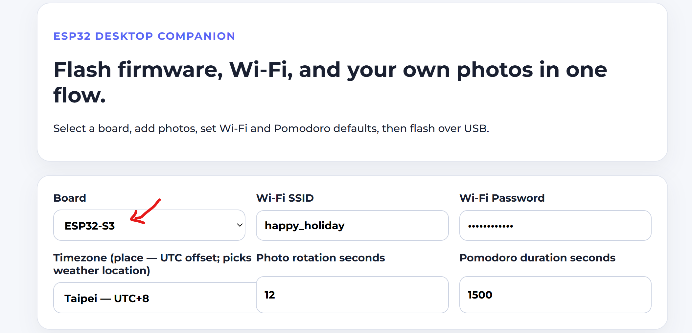
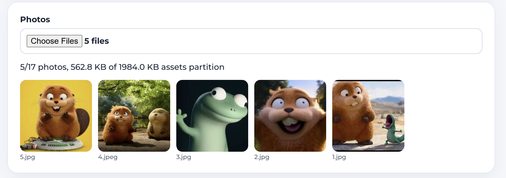
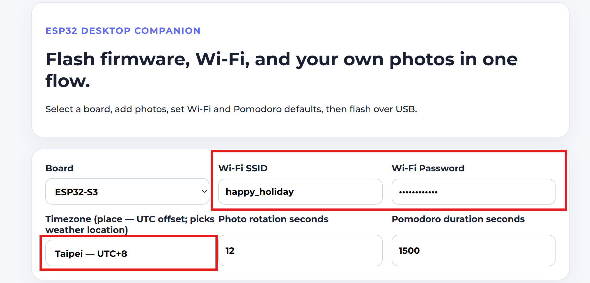
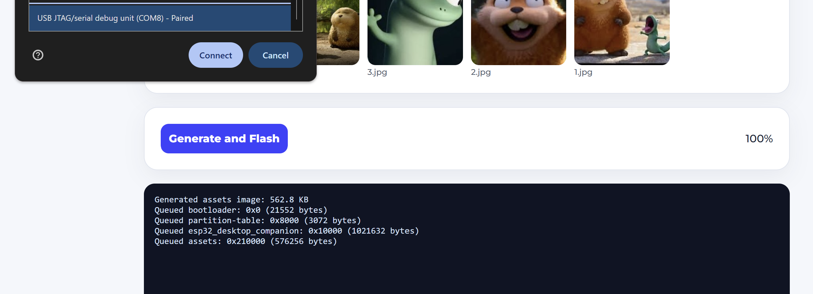

# Desktop Companion

ESP-IDF firmware plus a browser-based flasher for a 240×240 ST7789 photo frame: your photos, clock, Pomodoro timer, and (with Wi‑Fi) a quick weather readout from [Open-Meteo](https://open-meteo.com/).

---

## Flashing from the browser (recommended)

You need **Chrome or Edge** (Web Serial), a **USB data cable**, and a board this repo supports (e.g. ESP32-S3, ESP32-C3, ESP32-C6—check the **Board** dropdown in the flasher).

1. **Open the flasher**  
   Use the hosted GitHub Pages build, or run it locally after `cd web && npm ci && npm run build` and serve the `web/dist` folder over **HTTPS** (or `localhost`). Plain `file://` URLs will not expose serial.

2. **Pick the board**  
   Choose the profile that matches your chip. The flasher uses the right firmware manifest and asset size for that target.

   

3. **Add photos**  
   Select one or more images; they’re cropped to 240×240, slightly dimmed, and converted to RGB565. You need at least one photo before flashing.

   

4. **Wi‑Fi and Pomodoro**  
   Enter **SSID** and **password**, set **photo rotation** and Pomodoro defaults if you want something other than the stock values.

   

5. **Connect USB and flash**  
   Plug in the board, click **Generate and Flash**, and pick the serial port when the browser asks. Let it run to 100%; the device resets when done.

   

**First boot:** the device reads Wi‑Fi and settings from the flashed assets partition and copies them into NVS where needed. If something looks wrong after a flash, do a hard refresh on the flasher page so you aren’t using a cached old manifest.

---

## If flashing fails

`invalid header: 0xffffffff` means the ROM is reading erased flash where the bootloader should be—the board is usually **not** bricked.

The web app’s offsets come from the same ESP-IDF build as the bundled binaries (`flasher_args.json` → manifest). Fix: deploy or pull the **latest** flasher + firmware bundle, hard-refresh the page, try again, and use **BOOT + reset** to force download mode if your board needs it.

---

## On-device behavior (firmware)

- **Gallery** is the base screen; photos rotate at the interval you flashed.
- **Clock:** local time uses **UTC offset from IP geolocation** (same HTTPS lookup as weather). On first successful Wi‑Fi, the device sets `TZ` from the API’s `utc_offset` (current offset, including active DST when the service reports it). A **daily** refresh re-fetches geolocation so long-running devices can track offset changes. Until the first lookup completes, the clock may show **UTC**. VPNs and captive portals skew the result.
- **Short press** cycles: **clock → Pomodoro → weather → clock**.
- **Pomodoro:** phases auto-chain **focus → short break → focus …** with a **long break** every **N** completed focus sessions (defaults from the flasher). Double press **+5 min** and triple press **−5 min** adjust **focus length** only (minimum 5 min). Long press **pause/resume** the current phase without resetting the countdown. The timer keeps advancing while you’re on the clock or weather screen when running.
- **Weather:** needs Wi‑Fi; resolves approximate coordinates from your public IP (HTTPS), then fetches temperature, condition code, and an on-screen glyph via Open‑Meteo. Refreshes when you open that screen and about every ten minutes while you stay on it.

Hardware assembly and a release checklist live in [`docs/HARDWARE_TEST.md`](docs/HARDWARE_TEST.md).

---

## Flash layout

The generated **assets** partition sits after the factory app:

| Partition | Offset   | Size     | Purpose |
|-----------|----------|----------|---------|
| `nvs`     | `0x9000` | `0x6000` | Wi‑Fi / runtime config |
| `phy_init`| `0xf000` | `0x1000` | RF calibration |
| `factory` | `0x10000`| `2M`     | ESP-IDF app |
| `assets`  | `0x210000` | `0x1F0000` | 256-byte header + RGB565 images |

Each 240×240 RGB565 image is `115200` bytes. The current assets region fits **17** photos after the header.

### Asset header (256 bytes, little-endian)

- Magic `DCAS`, format version (**v2** current; **v1** still readable), screen size, image count  
- Rotation interval, Pomodoro **focus** seconds, asset ID (NVS migration)  
- Pomodoro **short break**, **long break**, **long break every N** (v2; v1 assets use firmware defaults)  
- Timezone string, SSID, password (timezone slot is **legacy/empty** in current flashes; the device does not use it for the clock)  
- Optional weather latitude/longitude (µ°; normally **0** — weather uses IP geolocation on device)

Credentials in flash are convenient for a desk toy; they are **not** secret unless you enable flash encryption.

---

## Developing firmware locally

```bash
idf.py set-target esp32s3   # or esp32c3 / esp32c6
idf.py build
```

## Developing / hosting the web flasher

```bash
cd web
npm ci
npm run build
```

CI builds firmware for supported targets, turns `flasher_args.json` into per-board web manifests, copies binaries into the site, and can deploy GitHub Pages.

Before changing partitions, NVS, or Wi‑Fi storage, skim the ESP-IDF docs for **partition tables**, **NVS**, **`esp_partition`**, and **Wi‑Fi station**.

### Local time and IP geolocation

The firmware does **not** use a flashed timezone. After Wi‑Fi connects, it calls **ipapi.co** and applies the returned **`utc_offset`** (seconds) to the C library `TZ` (with **daily** re-fetch to pick up **DST** changes). For source and rate limits, see [ipapi.co](https://ipapi.co/).

If you need a different policy (e.g. fixed UTC), change [`wifi_time_set_tz_from_utc_offset_sec`](components/wifi_time/wifi_time.c) and/or the refresh cadence in [`main.c`](main/main.c).
